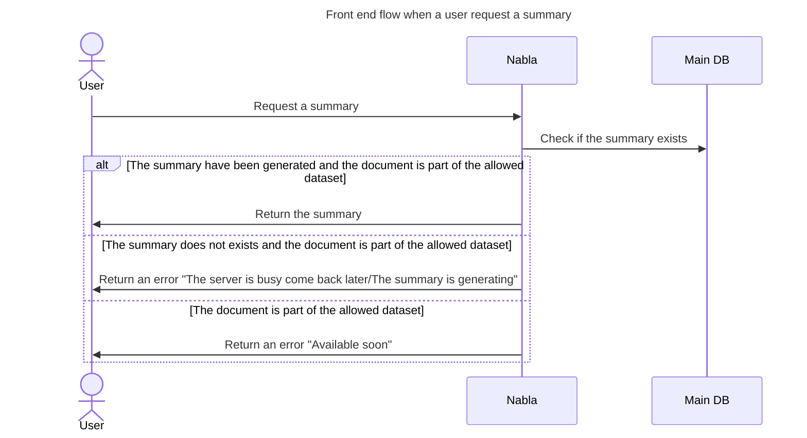
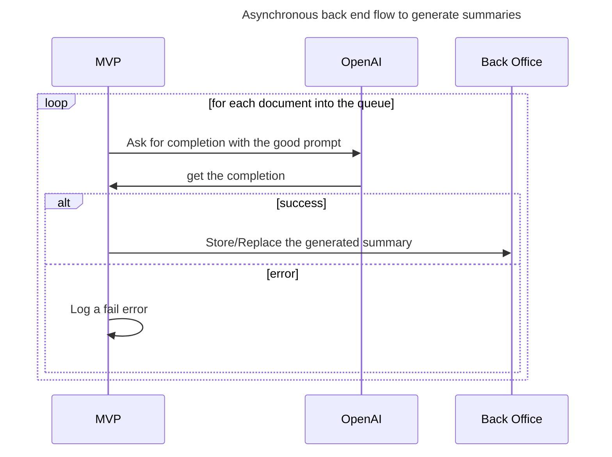
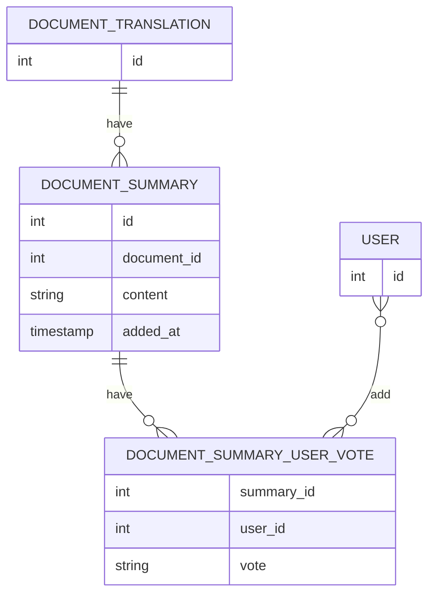
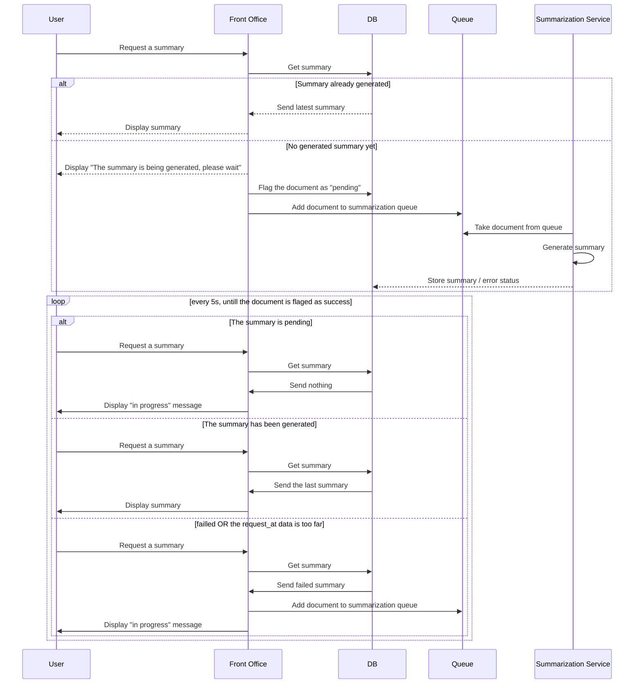
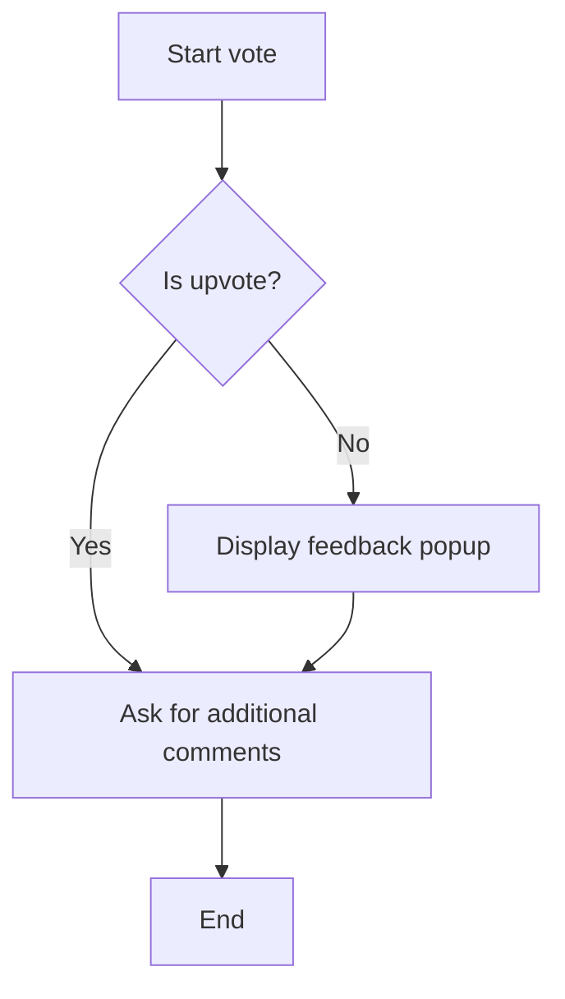

<!-- markdown-link-check-disable-next-line -->

## [](https://github.com/AlbanAndrieu) nabla-hooks

Nabla custom git hooks

[](http://www.apache.org/licenses/LICENSE-2.0.html)
[](https://gitter.im/nabla-hooks/Lobby?utm_source=badge&utm_medium=badge&utm_campaign=pr-badge)

[](https://github.com/AlbanAndrieu/nabla-hooks/pulls)

This project intend to be uses by all Nabla products

# Table of contents

<!-- markdown-link-check-disable -->

// spell-checker:disable

<!-- toc -->

<!-- tocstop -->

// spell-checker:enable

<!-- markdown-link-check-enable -->

# [Initialize](#table-of-contents)

```bash
direnv allow
pyenv install 3.8.10
pyenv local 3.8.10
python -m pipenv install --dev --ignore-pipfile
direnv allow
pre-commit install
```

## [Requirements](#table-of-contents)

This hooks requires the following to run:

<!-- markdown-link-check-disable-next-line -->

- [jira](https://pypi.org/project/jira/)

## [Diagrams](#table-of-contents)

Sample of mermaid:

<!-- markdown-link-check-disable -->











<!-- markdown-link-check-enable -->
